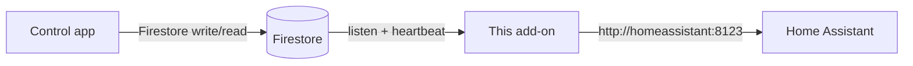
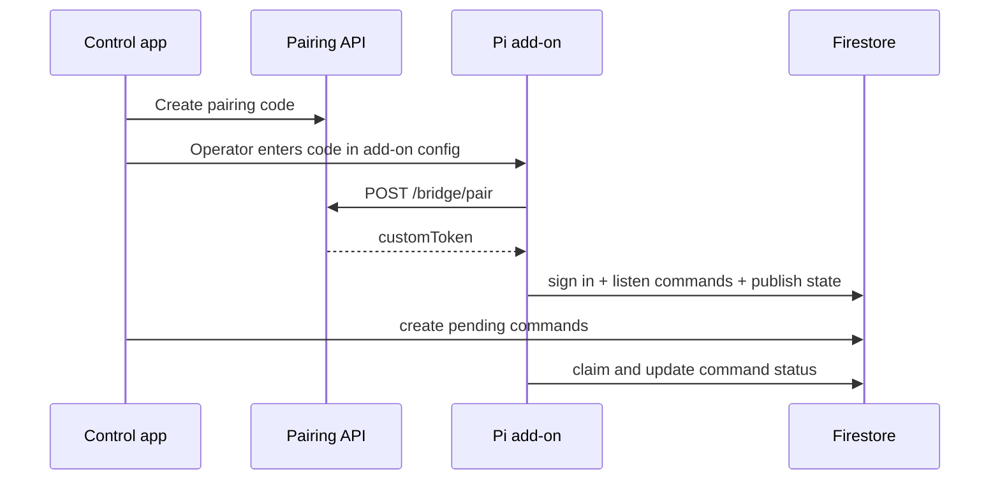

# Firestore Home Assistant Bridge

Home Assistant add-on that listens **outbound** to Google Firestore, runs commands against local Home Assistant, and publishes cached device state. Remote clients never need a public HA URL or a long-lived HA token on phones and browsers.

The Pi only needs outbound HTTPS (Firestore + your pairing API). Home Assistant stays on the LAN.

---

## Before you install

This add-on is **not standalone**. It is the Pi-side worker for a Firebase-backed control plane you operate separately.

| You must have | Purpose |
|---------------|---------|
| **Firebase project** | Auth + Firestore |
| **Firestore layout** (below) | Command queue, state, device heartbeat |
| **Security rules** | Org members enqueue commands; bridge device executes them |
| **Pairing API** | One-time codes → Firebase custom token for the Pi |
| **Control app** | Issues pairing codes, writes org config, creates `pending` commands, reads state |
| **Home Assistant** | Local lights/scenes; long-lived token stays on the Pi |

If any of the above is missing, the add-on will install but pairing or Firestore access will fail.

---

## Requirements

### 1. Firestore structure

Multi-tenant layout: tenants under `organizations/{orgId}`, bridge data under integration id **`homeAssistantBridge`**.

Your control app, pairing API, and Pi add-on config must agree on **`org_id`**, **`setup_id`**, and **`device_id`**.

#### Paths

```text
organizations/{orgId}/
└── integrations/homeAssistantBridge/
    ├── devices/{deviceId}       ← Pi heartbeat (add-on writes)
    ├── commands/{commandId}     ← queue (app creates, add-on updates)
    └── state/{setupId}          ← cached light states (add-on writes)
```

| Add-on config | Firestore |
|---------------|-----------|
| `org_id` | `{orgId}` in all paths; token claim `haBridgeOrgId` |
| `setup_id` | `{setupId}` in `state/{setupId}`; field `setupId` on commands |
| `device_id` | `{deviceId}` in `devices/{deviceId}`; token claim `haBridgeDeviceId` |

One Pi per `setup_id` is typical. Multiple Pis sharing one `setup_id` share one command queue (unusual).

#### Bridge authentication

After pairing, the add-on uses a Firebase **custom token**. Your pairing API should mint:

| Claim | Value |
|-------|--------|
| `uid` | Recommended: `ha-bridge:{orgId}:{deviceId}` |
| `haBridgeOrgId` | Same as `org_id` |
| `haBridgeDeviceId` | Same as `device_id` |

**Security rules** (adapt to your project):

- **Org members** — read devices, state, commands; create commands with `status: "pending"` only
- **Bridge device** — read org doc, commands, state, devices; update command status; write its device doc and state doc

```javascript
function isHaBridgeDevice(orgId) {
  return request.auth != null &&
    request.auth.token.haBridgeOrgId == orgId &&
    request.auth.token.haBridgeDeviceId is string;
}
```

#### Document: `devices/{deviceId}`

Written by the add-on (heartbeat, default every 60s).

| Field | Type | Notes |
|-------|------|--------|
| `id` | string | Same as `device_id` |
| `organizationId` | string | Same as `org_id` |
| `setupId` | string | Same as `setup_id` |
| `lastSeen` | string | ISO-8601 UTC |
| `status` | string | `"online"` while running |
| `version` | string | Add-on version |
| `hostname` | string | Optional |

Clients treat the bridge as offline if `lastSeen` is older than ~60 seconds.

#### Document: `commands/{commandId}`

**Created by control app** (authenticated member):

| Field | Required | Notes |
|-------|----------|--------|
| `setupId` | Yes | Must match Pi `setup_id` |
| `type` | Yes | `ping` \| `lightSet` \| `lightOff` \| `sceneActivate` |
| `status` | Yes | Must be `"pending"` on create |
| `issuedAt` | Yes | ISO-8601 UTC |
| `issuedBy` | No | User uid |

Type-specific fields:

| `type` | Fields |
|--------|--------|
| `ping` | — |
| `lightSet` | `entityId`, optional `brightnessPct` (1–100) |
| `lightOff` | `entityId` |
| `sceneActivate` | `entityId`, optional `transition` (seconds) |

**Updated by add-on:** `status` → `processing` → `applied` or `failed`; optional `processingStartedAt`, `processedAt`, `errorMessage`.

**Query:** pending commands where `setupId == setup_id`, ordered by `issuedAt` ASC (limit 20). Create a composite index if Firestore asks:

- Collection group `commands`: `setupId` ASC, `status` ASC, `issuedAt` ASC

#### Document: `state/{setupId}`

Written by the add-on (default every 15s).

| Field | Type |
|-------|------|
| `setupId`, `organizationId`, `updatedAt`, `bridgeDeviceId` | string |
| `lights` | array of `{ entity_id, state, attributes? }` |

#### Org document — light entity list

The add-on **reads** `organizations/{orgId}` to know which entities to snapshot:

```text
settings.integrations.homeAssistant.setups[]
  └── entry where id == setup_id
        └── lights[].entityId
```

Example:

```json
{
  "settings": {
    "integrations": {
      "homeAssistant": {
        "setups": [
          {
            "id": "your-setup-id",
            "lights": [
              { "entityId": "light.sanctuary" },
              { "entityId": "light.foyer" }
            ]
          }
        ]
      }
    }
  }
}
```

Without this, commands and heartbeats still work; **light state is not published**. Fork the add-on if you use a different settings shape.

#### Command → Home Assistant mapping

| `type` | HA REST |
|--------|---------|
| `ping` | `GET /api/` |
| `lightSet` | `POST /api/services/light/turn_on` |
| `lightOff` | `POST /api/services/light/turn_off` |
| `sceneActivate` | `POST /api/services/scene/turn_on` |

---

### 2. Pairing API

Your backend must implement code generation (control app) and redemption (Pi).

| Step | Caller | Endpoint |
|------|--------|----------|
| Create code | Control app | Your app-specific endpoint (stores code with `orgId` + `setupId`, short TTL) |
| Redeem code | Pi add-on | `POST {edge_base_url}/api/integrations/ha/bridge/pair` |

**Pair request body:**

```json
{
  "orgId": "your-org-id",
  "setupId": "your-setup-id",
  "pairingCode": "123456",
  "deviceId": "uuid",
  "hostname": "optional-hostname"
}
```

**Pair response:** `{ "customToken": "..." }` (Firebase custom token with claims above).

Codes should be one-time and time-limited. `orgId`, `setupId`, and `pairingCode` must match what was stored when the code was created.

---

### 3. Control app

Your client application (web, desktop, mobile) is responsible for:

- Authenticating users as org members
- Persisting the org document (including light `entityId` list per setup)
- Generating pairing codes via your backend
- Creating Firestore commands with `status: "pending"`
- Reading `state/{setupId}` and `devices/{deviceId}` for UI

The add-on does not include a control app.

---

### 4. Home Assistant

- Home Assistant reachable from the add-on container (`http://homeassistant:8123` on HA OS)
- Long-lived access token configured in add-on `ha_access_token` (never on client devices)

---

## How it works





On first run the add-on calls your pairing API, stores refresh credentials in `/data/bridge_credentials.json`, then uses Firestore until credentials expire or are cleared.

**Idle pause (v0.1.14+):** after `idle_pause_hours` (default 2) with no lighting commands, the add-on pauses heartbeat/state writes (`devices` status → `idle`) but keeps listening/polling for pending commands and refreshes Firebase auth. The next command auto-resumes — no Supervisor restart. This also addresses the old ~60‑minute “stuck until restart” failure (expired ID token).

**Church-Pi safety (v0.1.13+):** atomic credential writes; HA ping retries on startup (no crash-loop if HA is briefly down during update); Dockerfile installs `requests` hard and google listen SDKs soft; command status patches retry; light state fingerprint uses `entity_id` correctly.

**Quota / auth hardening (v0.1.12+):** REST ID tokens refresh before expiry and rotated refresh tokens are persisted; credential wipe only on hard auth death (not transient 401/403); `org_id` is lowercased to match Edge claims; paired `device_id` wins over edited options; TTL cleanup orders by `processedAt`; google listen SDKs install best-effort so Alpine/arm builds still succeed.

**Quota guards (v0.1.10+):** pending commands use Firestore listen/push (with a slow catch-up poll); state/heartbeat default to 60s and skip unchanged state; PATCH-first upserts after restart; command claim/idempotency + TTL cleanup; write-rate circuit breaker; clean exit on `USER_DISABLED`. Legacy interval options (e.g. poll `2`, state `15`) remain valid in the add-on schema and are clamped in Python.

---

## Install

### Home Assistant OS (repository)

1. **Settings → Apps → Repositories → Add**
2. URL: `https://github.com/mmorera-25/firestore-home-assistant-bridge`
3. **Check for updates**
4. **Firestore HA Bridge** → **Install**
5. Configure (below), then **Start**

### Local folder (optional)

Copy `firestore_ha_bridge/` to `addons/local/firestore_ha_bridge/`, then **Check for updates**.

---

## Configure and pair

Sensitive add-on fields (`org_id`, `setup_id`, tokens, keys, pairing code) use **masked** inputs in the Home Assistant configuration UI. URLs and the Firebase project id stay visible for easier verification.

**Pairing code (temporary):** paste a desktop-generated code for first-time pairing only. After a successful pair, the add-on **clears `pairing_code` automatically** and restarts once (v0.1.2+). Codes also expire on the server after ~10 minutes.

### Add-on options

| Field | Required | Masked in HA UI | Description |
|-------|----------|-----------------|-------------|
| `org_id` | Yes | Yes | Tenant id — `{orgId}` in Firestore paths |
| `setup_id` | Yes | Yes | Bridge scope — command queue + state doc |
| `edge_base_url` | Yes | No | Pairing API origin, no trailing slash |
| `ha_base_url` | Yes | No | Default `http://homeassistant:8123` on HA OS |
| `ha_access_token` | Yes | Yes | HA long-lived token (Pi only) |
| `firebase_api_key` | Yes | Yes | Firebase Web API key |
| `firebase_project_id` | Yes | No | Firebase project id |
| `pairing_code` | First run | Yes | From control app until `/data/bridge_credentials.json` exists |
| `device_id` | No | Yes | Leave blank — auto-generated on first pair and saved to add-on config (v0.1.6+) |
| `poll_interval_seconds` | No | No | Catch-up poll interval (listen is primary). Default `10`. Schema accepts `1–300`; runtime clamps below `5` up to `5`. |
| `state_interval_seconds` | No | No | Default `60`. Schema accepts `1–300`; runtime clamps below `30` up to `30`. |
| `heartbeat_interval_seconds` | No | No | Default `60`. Schema accepts `1–300`; runtime clamps below `30` up to `30`. |
| `idle_pause_hours` | No | No | Default `2`. After this many hours with **no lighting commands**, pause heartbeat/state writes to save Firestore quota. Keeps a slow pending-command poll + listen so the next command **auto-resumes** (no add-on restart). Set `0` to disable. |

### Example

```yaml
org_id: "your-org-id"
setup_id: "your-setup-id"
edge_base_url: "https://your-pairing-api.example.com"
ha_base_url: "http://homeassistant:8123"
ha_access_token: "YOUR_HA_LONG_LIVED_TOKEN"
firebase_api_key: "YOUR_FIREBASE_WEB_API_KEY"
firebase_project_id: "your-firebase-project-id"
pairing_code: "123456"
device_id: ""
```

### First run

1. Issue a pairing code from your control app
2. Fill all required fields; paste code into `pairing_code`
3. **Start** the add-on
4. Confirm `devices/{deviceId}` shows recent `lastSeen` in Firestore
5. Clear `pairing_code` and restart (recommended)

---

## Troubleshooting

| Symptom | Likely cause | Fix |
|---------|--------------|-----|
| Add-on not in app store | Repository missing, stale store, or invalid `config.yaml` | Add repo URL; **Check for updates**; check **Supervisor → Log** for `Invalid Add-on config` on this repo |
| `PAIRING_CODE is required` | No stored credentials | Set `pairing_code`; start within TTL |
| `Pairing failed` / 503 | Pairing API or service account missing | Deploy backend; check `edge_base_url` |
| `Invalid or expired pairing code` | Wrong/expired code or org/setup mismatch | New code; match `org_id` + `setup_id` |
| Build failed installing add-on | Missing base image / pip on Alpine | Update to latest add-on version; **Check for updates**; see Supervisor log for `BUILD_FROM` or `pip` errors |
| HA errors in logs | Bad token or HA down | New token; verify `ha_base_url` |
| Stale `lastSeen` | Firebase auth failure | Check `firebase_api_key` / `firebase_project_id` |
| `USER_NOT_FOUND` on startup | Stale credentials after revoke or failed pair | v0.1.5+ clears bad credentials; set fresh `pairing_code` and restart |
| Log shows `device=null` | HA sends literal `null` for empty optional fields | v0.1.5+ treats `null` as blank; optional: set stable `device_id` UUID |
| Firestore permission denied | Rules or token claims wrong | Deploy rules; verify `haBridgeOrgId` / `haBridgeDeviceId` |
| Commands work, no light state | Org document missing entity list | Add `settings.integrations.homeAssistant.setups[].lights` |
| Firestore index error in logs | Missing composite index | Add index on `commands`: setupId, status, issuedAt |

---

## Updating on the Pi

1. Bump `version` in `firestore_ha_bridge/config.yaml`
2. Push to this repository
3. **Settings → Apps → Firestore HA Bridge → Update**

Home Assistant uses **`config.yaml` version**, not git tags.

---

## Development

```bash
npm run push
# optional:
BACKUP_LABEL=bridge npm run push
```

Creates a timestamped commit and backup tag (`backup-YYYYMMDD-HHMMSS`).

---

## License

MIT — see [LICENSE](./LICENSE).
