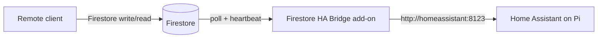

# Firestore Home Assistant Bridge

Home Assistant add-on that listens **outbound** to Google Firestore, executes lighting commands against local Home Assistant, and publishes cached light state — so remote clients never need a public HA URL or long-lived HA token on the phone.

Designed for use with [Resonare Worship Stage](https://github.com/mmorera-25/resonare-worship-stage) (PWA **Firebase bridge** mode), but the add-on itself is generic Firestore + HA REST.

## Architecture



## Install on Home Assistant OS

1. **Settings → Apps → Repositories → Add**
2. Repository URL:
   ```
   https://github.com/mmorera-25/firestore-home-assistant-bridge
   ```
3. **Check for updates** (refreshes the app store)
4. Find **Firestore HA Bridge** under the new repository → **Install**
5. Fill **Configuration** (see below) before starting

### Alternative: local add-on folder

Copy the `firestore_ha_bridge/` folder into `addons/local/firestore_ha_bridge/` on the Pi, then **Check for updates** under **Settings → Apps → App store**.

---

## Configuration

| Field | Description |
|-------|-------------|
| `org_id` | Firestore organization id (lowercase), e.g. `organizations/{orgId}` |
| `setup_id` | Home Assistant setup id from your control app |
| `edge_base_url` | Edge worker origin for pairing (no trailing slash), e.g. `https://your-worker.workers.dev` |
| `ha_base_url` | `http://homeassistant:8123` on HA OS (default) |
| `ha_access_token` | HA → **Profile → Security → Long-lived access tokens** (stays on Pi only) |
| `firebase_api_key` | Firebase project → Project settings → Web API key |
| `firebase_project_id` | Firebase project id |
| `device_id` | Optional — leave blank to auto-generate |
| `pairing_code` | One-time code from your control app (first run only) |

After successful pairing, credentials are stored in `/data/bridge_credentials.json`. Clear `pairing_code` from config after pairing (recommended).

---

## Pairing (Resonare)

1. Desktop → **Settings → Connections → Home Assistant** → **Generate bridge pairing code**
2. Paste the 6-digit code into add-on **`pairing_code`**
3. Fill all other required fields → **Start** the add-on

Pairing calls your Edge worker at `POST /api/integrations/ha/bridge/pair`. See [Resonare HA bridge pairing docs](https://github.com/mmorera-25/resonare-worship-stage/blob/main/documentation/features/ha-bridge-pairing.md) for full setup (Edge D1 migration + Firebase service account secrets).

---

## Firestore paths (per org)

| Path | Purpose |
|------|---------|
| `integrations/homeAssistantBridge/devices/{deviceId}` | Pi heartbeat (`lastSeen`, `status`) |
| `integrations/homeAssistantBridge/commands/{commandId}` | Command queue (`pending` → `applied` \| `failed`) |
| `integrations/homeAssistantBridge/state/{setupId}` | Cached light states (~15s) |

---

## Troubleshooting

| Symptom | Likely cause | Fix |
|---------|--------------|-----|
| Add-on not in App store | Repository not added or stale store | Re-add repo URL; **Check for updates** |
| `PAIRING_CODE is required` | First run without stored credentials | Generate pairing code; start within ~10 min |
| `Pairing failed` / 503 | Edge not configured | Deploy Edge D1 migration + Firebase service account secrets |
| Commands timeout | Invalid HA token or HA down | New long-lived token; verify HA is reachable |
| Stale `lastSeen` | Firebase auth or network | Check add-on logs; verify Firebase fields |

---

## Development

### Push to GitHub

```bash
npm run push
# optional label:
BACKUP_LABEL=bridge npm run push
```

Creates a timestamped commit and tag (`backup-YYYYMMDD-HHMMSS` or `backup-{label}-YYYYMMDD-HHMMSS`). Use this for development snapshots.

### Release a version for the Pi

Home Assistant reads the add-on version from `firestore_ha_bridge/config.yaml`.

1. Bump **`version`** in `firestore_ha_bridge/config.yaml` (semver, e.g. `0.1.0` → `0.1.1`)
2. Commit and push to `main` (`npm run push` or a normal git push)
3. On the Pi: **Settings → Apps → Firestore HA Bridge → Update**

Backup tags from `npm run push` are for your git history; the Pi **Update** button tracks **`config.yaml` version**, not git tags.

---

## License

MIT — see [LICENSE](./LICENSE).
